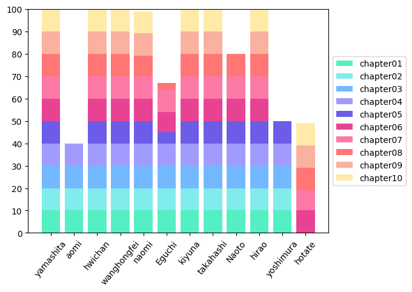

# 100knock2019

小町研2019年度新入生向け勉強会として、言語処理100本ノックに取り組みます。  
教材URL: http://www.cl.ecei.tohoku.ac.jp/nlp100/

毎週1章分 (10問) 解いてください。  
勉強会のときに1人1問ずつ自分のコードを説明してもらいます。  

取り組む際には、以下のことを行ってください。
1. `$git pull` (masterブランチで）
2. `$git checkout -b chapter##-name`（ブランチを作成）
3. "chapter##" という名前でディレクトリを作成
4. "chapter##" の下に "knock##.py" という名前でスクリプトを書く
5. `$ git add 作成したスクリプト名`(複数 add する場合はファイルを列挙　全てあげるなら `$git add .`）
6. `$ git commit -m 'ひとこと'`  

一章分のスクリプトをコミットしたら勉強会が始まるまでにリモートリポジトリにプッシュしてマージしてブランチを削除してください
1. `$ git push origin chapter##-name`
2. [Githubのページ](https://github.com/tmu-nlp/100knock2019/)に **Compare and pull request** というボタンが出るので押す
3. コメントを残して**Create pull request**ボタンを押す
4. 下の方に**Merge pull request**というボタンが出るので押す

(出力結果はcommitしなくてよいです。(画像に関してはどちらでもよいです。) )  
(後半になると出力するファイルのサイズが大きいものも出てくるからです。)  

### 注意事項  
新入生はできるだけPython3系で書いてください。  
わからないところは**積極的に**TAか研究室の人に聞いてください。  
**他の人のディレクトリを変更することは絶対にやめてください。**  
(他の人のコードを閲覧したい場合は、Webサイト上から閲覧してください。)  
chapter##/knock##.py のフォルダ名とファイル名を間違えると進捗グラフに反映されません。

＊10章91番の`単語アナロジーデータ`のリンクが切れているので，以下のコマンドでダウンロードしてください　

```
curl https://raw.githubusercontent.com/svn2github/word2vec/master/questions-words.txt > questions-words.txt
```

or 

```
wget https://raw.githubusercontent.com/svn2github/word2vec/master/questions-words.txt
```

# みんなの進捗


## 100knock2019 (English)  
We will work NLP 100 knockings as the study meeting for the newcomers in 2019.  
Let's solve the 10 questions every week!  
TA and participants review your code.  

If you try this task, please keep the following rules.  
1. make the new directory named "chapter##"  
2. make your answer script named "knock##.py"  
3. `$ git add knock##.py`("##" means "two-disit question number")  
4. `$ git commit -m 'your message'`  
5. `$ git pull`  
6. `$ git push`  

## Notes  
Please use Python3.  
Please ask TA's helps **positively**.  
Please commit your script and picture only. (Don't commit the other files such as text file because file size of the output will be gradually larger.)  
**Don't change the others' directories.**  
Teaching materials of this meeting are written in Japanese, so some participants need to translate them.
